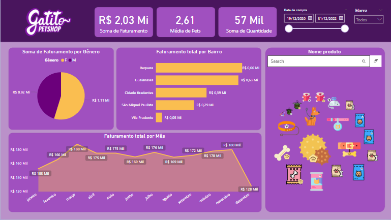

# 📊 Relatório Power BI - Pet Shop

 

## 📌 Sobre o Projeto
Este projeto é um **dashboard interativo no Power BI** desenvolvido com base em um curso da **Alura**. Ele apresenta **relatórios gerenciais** para um pet shop, ajudando a proprietária a tomar decisões estratégicas sobre o seu negócio.

## 📊 Principais Insights
✅ Análise de faturamento 🏆   
✅ Distribuição de clientes por bairro 🐶🐱  
✅ Distribuição de venda de produtos por marca 🐶🐱  
✅ Distribuição de clientes por gênero 💰  

## 📷 Dashboard

## 🛠️ Tecnologias Utilizadas
- **Power BI** para criação do relatório
- **DAX** para cálculos e medidas
- **Power Query** para transformação de dados
- **Excel/CSV e .TXT** como fonte de dados

